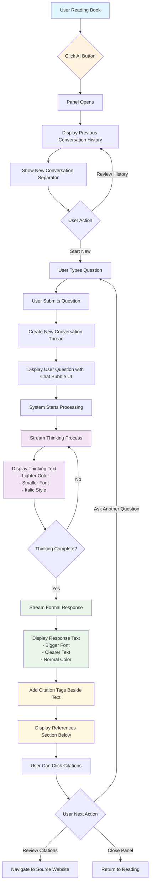

### Improvement Goal
- The QA Module of the Reading Book

- Related code (17 files)
  1. `src/components/ui/AIMessageBubble.tsx` - Unified AI message component combining thinking process, answer content, and citations in a single bubble
  2. `src/components/ui/StructuredQAResponse.tsx` - Structured answer display with numbered sections, professional typography, and inline citation integration
  3. `src/components/ui/ThinkingProcessIndicator.tsx` - AI thinking status visualization with collapsible "Thought for X seconds" header
  4. `src/components/ui/ConversationFlow.tsx` - Messaging-app-style conversation interface with message bubbles, timestamps, and "--開啟新對話--" separator
  5. `src/components/ui/CitationDisplay.tsx` - Citation rendering component with interactive links and reference management
  6. `src/styles/qa-module.css` - Professional visual hierarchy with typography scales, spacing tokens, and semantic color system
  7. `src/app/api/perplexity-qa-stream/route.ts` - Server-Sent Events (SSE) streaming API endpoint for real-time response delivery
  8. `src/ai/flows/perplexity-red-chamber-qa.ts` - Perplexity AI integration flow using Sonar reasoning models for Red Chamber literature QA
  9. `src/ai/flows/grounded-red-chamber-qa.ts` - Grounded QA implementation with knowledge base grounding for accurate literary analysis
  10. `src/ai/perplexity-config.ts` - Perplexity model configuration with adaptive timeout strategy (30s-120s based on question complexity)
  11. `src/lib/perplexity-client.ts` - Perplexity API client wrapper with streaming support and error handling
  12. `src/lib/perplexity-error-handler.ts` - Error classification system (timeout, rate limit, API, network) and progressive recovery strategies
  13. `src/lib/citation-processor.ts` - Citation parsing, inline integration utilities, and reference section generation
  14. `src/types/perplexity-qa.ts` - Perplexity QA type definitions including streaming response interfaces and citation structures
  15. `src/types/grounded-qa.ts` - Grounded QA type definitions for knowledge-base-backed literary analysis
  16. `src/app/(main)/read-book/page.tsx` - QA module integration in reading interface with conversation state management and localStorage persistence
  17. `docs/improvement_report/The QA Module of the Reading Book.md` - Comprehensive documentation of QA module architecture, user flow, and implementation standards

### Current QA Module User Process Flow



### Detailed Process Description

#### Phase 1: Initiation & Context Display
**Step 1: User Interaction Trigger**
- User clicks the "AI" or "問AI" button while reading
- Button is typically located in the reading interface toolbar
- Triggers the QA panel to open

**Step 2: Panel Opening & History Display**
- QA panel slides out from the side or overlays the reading content
- System retrieves and displays previous conversation history
- Conversations are displayed chronologically with user questions and AI responses
- Each conversation shows timestamps and basic metadata

**Step 3: New Conversation Indicator**
- At the bottom of the conversation history, system displays "--開啟新對話--" text
- This serves as a visual separator between past conversations and new input area
- Indicates where new conversations will appear

#### Phase 2: Question Input & Submission
**Step 4: Question Input**
- User can review previous conversations or start typing a new question
- Input field appears below the "--開啟新對話--" separator
- Interface supports multi-line text input for complex questions
- Real-time character count and basic validation

**Step 5: Question Submission**
- User submits question via Enter key or Submit button
- System validates input and starts processing
- New conversation thread is created below the separator line

#### Phase 3: Response Generation & Display
**Step 6: Conversation Thread Creation**
- User question appears in a chat bubble with user avatar/icon
- Follows messaging app UI conventions with right-aligned user messages
- Timestamp and status indicators are displayed

**Step 7: Thinking Process Visualization**
- System begins streaming "深度思考" (deep thinking) content
- Thinking text characteristics:
  - **Color**: Lighter/muted color (--muted-foreground)
  - **Font Size**: Smaller than normal text (0.875rem)
  - **Style**: Italic to distinguish from final response
  - **Animation**: May include typing indicators or subtle animations

**Step 8: Progressive Response Streaming**
- Once thinking process completes, system streams the formal response
- Formal response characteristics:
  - **Font Size**: Larger and more prominent
  - **Color**: Full contrast color for readability
  - **Formatting**: Structured with proper spacing and hierarchy
  - **Real-time Display**: Text appears progressively as it's generated

#### Phase 4: Citation & Reference Integration
**Step 9: Citation Integration**
- "來源" (source) tags appear beside relevant parts of the response
- Citations are numbered and clickable (e.g., [1], [2], [3])
- Integrated seamlessly into the text flow without disrupting reading
- Hover states provide preview information

**Step 10: References Section**
- Complete references list appears below the main response
- Each reference includes:
  - Source title and URL
  - Publication date (if available)
  - Relevance score or snippet
  - Direct link to original source

#### Phase 5: User Interaction Options
**Step 11: Post-Response Actions**
- Users can click citation tags to navigate to source websites
- Option to ask follow-up questions in the same conversation thread
- Copy response text functionality
- Share or bookmark responses
- Close panel to return to reading

### Current Implementation Gaps
Based on the intended flow above, the current implementation lacks:
- Proper conversation history display and management
- "--開啟新對話--" separator implementation
- Structured thinking process visualization
- Professional chat bubble UI
- Seamless citation integration within text flow
- Comprehensive references section with proper formatting

## Critical Issues Identified

### 1. UI/UX Flow Does Not Follow Intended Design Pattern
**Problem**: Current QA module implementation significantly deviates from the intended user experience flow and professional UI design patterns shown in reference examples
- **Evidence**: Screenshots show well-structured responses with clear thinking process indicators, numbered sections, and seamless citation integration, while current implementation lacks these elements
- **Impact**: Users receive poorly organized responses that don't follow the documented conversation flow, resulting in suboptimal learning experience
- **Root Cause**: Implementation focused on basic functionality without following the specified UI/UX design patterns

#### Specific UI/UX Gaps Identified:

**1.1 Missing Structured Response Format**
- **Expected**: Responses organized into numbered sections (一、二、三) with clear thematic headings like "個人層面", "文化層面", "時代層面"
- **Current**: Unstructured markdown rendering without thematic organization
- **Impact**: Information appears disorganized and harder to digest

**1.2 No Thinking Process Status Indicator**
- **Expected**: Clear "已深度思考" status indicator with expandable/collapsible functionality
- **Current**: Basic loading states without clear thinking process visualization
- **Impact**: Users can't track AI reasoning progress or review thinking steps

**1.3 Poor Citation Integration**
- **Expected**: Seamlessly integrated numbered citations [1][2][3] within text flow, plus dedicated reference section
- **Current**: Citations displayed separately without proper integration into response text
- **Impact**: Reduced credibility and harder source verification

**1.4 Missing Conversation Flow Pattern**
- **Expected**: Proper conversation history display with "--開啟新對話--" pattern and messaging app-like UI
- **Current**: Basic panel without following documented conversation flow
- **Impact**: Inconsistent user experience that doesn't match expected interaction pattern

**1.5 Inadequate Visual Hierarchy**
- **Expected**: Professional typography with clear content hierarchy, proper spacing, and visual organization
- **Current**: Basic component rendering without sophisticated visual design
- **Impact**: Reduced readability and professional appearance

### 2. Timeout and Reliability Issues
**Problem**: Perplexity API timeout of 60000ms (60 seconds) is causing frequent failures
- **Evidence**: Terminal logs show "timeout of 60000ms exceeded" errors
- **Impact**: Users lose entire response when timeout occurs
- **Root Cause**: Fixed timeout configuration without progressive timeout handling

### 3. Poor Error Recovery Experience
**Problem**: When errors occur, users see generic error messages and lose all progress
- **Evidence**: Error handling shows "抱歉，處理您的問題時發生錯誤" without context
- **Impact**: Users don't understand why failures occur or how to resolve them
- **Root Cause**: Lack of graceful degradation and progressive enhancement

### 4. Missing Progressive Response Handling
**Problem**: No partial results preservation when streaming fails mid-process
- **Evidence**: Streaming chunks are lost on timeout, no fallback to partial content
- **Impact**: Users see nothing even if thinking process was partially received
- **Root Cause**: Streaming implementation doesn't preserve intermediate states

### 5. Inadequate Timeout Configuration Strategy
**Problem**: Single fixed timeout doesn't account for question complexity or model differences
- **Evidence**: Complex reasoning questions naturally take longer than simple queries
- **Impact**: More sophisticated questions have higher failure rates
- **Root Cause**: One-size-fits-all timeout configuration

## Proposed Improvements

### 1. Redesign UI/UX Flow to Follow Reference Design Pattern
**Solution**: Complete redesign of QA module UI to match professional design standards and intended user flow

#### 1.1 Implement Structured Response Display Component
```typescript
// New component: src/components/ui/StructuredQAResponse.tsx
interface StructuredSection {
  number: string;     // "一", "二", "三"
  title: string;      // "個人層面", "文化層面", "時代層面"
  content: string;
  citations: number[];
}

interface StructuredQAResponseProps {
  sections: StructuredSection[];
  thinkingProcess: string;
  citations: Citation[];
  isThinkingComplete: boolean;
  onCitationClick: (citationId: number) => void;
}
```

#### 1.2 Add Thinking Process Status Component
```typescript
// Enhancement: src/components/ui/ThinkingProcessIndicator.tsx
interface ThinkingProcessIndicatorProps {
  status: 'thinking' | 'complete' | 'error';
  content: string;
  isExpandable: boolean;
  isExpanded: boolean;
  onToggleExpand: () => void;
}

// Features:
// - "已深度思考" status with dropdown arrow
// - Expandable/collapsible thinking content
// - Real-time thinking process streaming
// - Visual progress indicators
```

#### 1.3 Enhance Citation Integration System
```typescript
// Enhancement: src/lib/citation-processor.ts
export function integrateInlineCitations(
  content: string,
  citations: Citation[]
): {
  processedContent: string;
  citationMap: Map<number, Citation>;
} {
  // Process content to add inline [1][2][3] citations
  // Create seamless integration with text flow
  // Generate dedicated reference section
}
```

#### 1.4 Implement Conversation Flow Pattern
```typescript
// Enhancement: src/components/ui/ConversationFlow.tsx
interface ConversationMessage {
  type: 'user' | 'ai' | 'system';
  content: string;
  timestamp: Date;
  citations?: Citation[];
  thinkingProcess?: string;
}

// Features:
// - "--開啟新對話--" pattern implementation
// - Message bubble UI like messaging apps
// - Conversation history preservation
// - Smooth transitions between conversations
```

#### 1.5 Professional Visual Hierarchy Implementation
```css
/* New styles: src/styles/qa-module.css */
.qa-response {
  /* Professional typography hierarchy */
  --heading-size: 1.25rem;
  --subheading-size: 1.1rem;
  --body-size: 1rem;
  --citation-size: 0.875rem;
  
  /* Semantic spacing system */
  --section-spacing: 2rem;
  --paragraph-spacing: 1rem;
  --citation-spacing: 0.5rem;
}

.thinking-process {
  /* Lighter, smaller text for thinking process */
  color: var(--muted-foreground);
  font-size: 0.875rem;
  font-style: italic;
}

.section-header {
  /* Clear section organization */
  font-weight: 600;
  margin-bottom: 1rem;
  border-bottom: 1px solid var(--border);
}
```

### 2. Implement Progressive Timeout Strategy
**Solution**: Dynamic timeout adjustment based on question complexity and model type
```typescript
// Improvement in src/ai/perplexity-config.ts
export const ADAPTIVE_TIMEOUT_CONFIG = {
  BASE_TIMEOUT: 45000,      // 45 seconds base
  REASONING_MULTIPLIER: 1.5, // 1.5x for reasoning models
  COMPLEX_QUESTION_BONUS: 30000, // +30s for complex questions
  MAX_TIMEOUT: 120000,      // 2 minutes maximum
  MIN_TIMEOUT: 30000,       // 30 seconds minimum
};
```

### 3. Add Progressive Error Recovery
**Enhancement**: Preserve partial responses and offer recovery options
- **Step 3 Enhancement**: Show progress indicators during submission
- **Step 4 Enhancement**: Preserve thinking process even if final response fails
- **New Step 4.1**: Offer retry options with different models/settings when timeout occurs
- **New Step 4.2**: Display partial thinking content with option to continue

### 4. Implement Smart Retry Mechanism
**Solution**: Automatic and user-initiated retry with model fallback
```typescript
// Improvement in src/ai/flows/perplexity-red-chamber-qa.ts
const RETRY_STRATEGY = {
  maxAttempts: 3,
  fallbackModels: ['sonar-reasoning-pro', 'sonar-reasoning', 'sonar-pro'],
  backoffDelays: [1000, 3000, 5000], // Progressive delays
  timeoutReduction: 0.8, // Reduce timeout by 20% on retry
};
```

### 5. Enhanced User Experience Improvements

#### Process Step 2 Enhancement: Connection Status
- Add API connection status indicator in the panel
- Show model availability and estimated response times
- Display user's question complexity score

#### Process Step 3 Enhancement: Smart Question Analysis
- Analyze question complexity before submission
- Suggest optimal model and settings
- Provide estimated processing time to set expectations

#### Process Step 4 Enhancement: Robust Streaming
- Show streaming progress with time estimates
- Preserve thinking process content even on timeout
- Implement graceful degradation to non-streaming mode

#### New Process Step 5: Error Recovery Options
- On timeout: Show partial results with retry options
- On API error: Suggest alternative models or simplified questions
- On rate limit: Show queue position and retry timer

### 6. Technical Implementation Roadmap

#### Phase 1: Critical UI/UX Redesign (Highest Priority)
1. **Implement StructuredQAResponse component** with numbered sections and professional layout
2. **Create ThinkingProcessIndicator** with "已深度思考" status and expandable functionality
3. **Redesign citation integration** for seamless inline references
4. **Implement ConversationFlow pattern** with "--開啟新對話--" and messaging UI
5. **Apply professional visual hierarchy** with proper typography and spacing

#### Phase 2: Immediate Technical Fixes (High Priority)
1. **Update timeout configuration** to be adaptive based on model and question type
2. **Implement partial response preservation** in streaming handlers
3. **Add basic retry mechanism** with exponential backoff
4. **Improve error messages** to be more specific and actionable

#### Phase 3: Enhanced UX Features (Medium Priority)
1. **Add progress indicators** with time estimates
2. **Implement question complexity analysis** for better timeout prediction
3. **Create fallback model selection** logic
4. **Add connection health monitoring**

#### Phase 4: Advanced Features (Lower Priority)
1. **Implement response caching** for similar questions
2. **Add smart question suggestions** based on failure patterns
3. **Create response quality scoring** and automatic model optimization
4. **Implement batch processing** for multiple questions

### 7. Code Quality Improvements

#### Error Handling Consolidation
- Centralize error handling logic in a dedicated error service
- Implement proper error classification (timeout, rate limit, API error, network error)
- Add comprehensive logging for debugging and monitoring

#### Type Safety Enhancement
- Strengthen TypeScript interfaces for streaming responses
- Add runtime validation for API responses
- Implement proper error type definitions

#### Performance Optimization
- Implement response streaming buffering to reduce UI updates
- Add connection pooling for better API performance
- Optimize retry logic to avoid unnecessary API calls

## Implementation Priority Summary

**CRITICAL PRIORITY**: The UI/UX flow redesign (Issue #1) must be addressed first as it represents the most significant gap between current implementation and intended design. Screenshots demonstrate the professional standard expected, and current implementation falls short of providing the structured, intuitive user experience described in the process documentation.

The visual and interaction design patterns shown in the reference screenshots should serve as the gold standard for the QA module implementation, with particular attention to:
- Structured response organization with clear sections
- Professional thinking process indicators
- Seamless citation integration
- Conversation flow that matches messaging app patterns
- Typography hierarchy that enhances readability

These improvements follow the Google engineering principle of streamlined development while maintaining high code quality and user experience standards, with user experience taking precedence as the primary driver of product success.